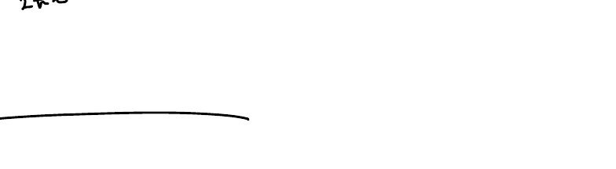
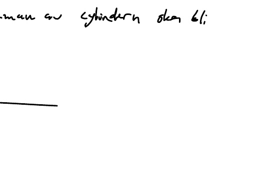

# F M6 2202.pdf

## Page 1

**Figures:**

---

# F: M6 22/02

Wednesday, 22 February 2023 10:23

## Rotations volym 1

$V = \int_{a}^{b} \pi [f(x)]^2 dx$

- **Exempel 1**: $f(x) = x^2$, $0 \leq x \leq 1$

  - $V = \int_{0}^{1} \pi x^4 dx = \pi \left[ \frac{x^5}{5} \right]_{0}^{1} = \frac{\pi}{5}$ v.e.

- **Exempel 2**: $f(x) = \frac{1}{x}$, $x \geq 1$

  - $V = \int_{1}^{\infty} \pi x^2 dx = \pi \lim_{b \to \infty} \left[ \frac{x^3}{3} \right]_{1}^{b} = \infty$ v.e.

## Skalet metod

$V = \int_{a}^{b} 2\pi x f(x) dx$ (bring y-axis)

- $ $ $ $ $ $ $ $ $ $ $ $ $ $ $ $ $ $ $ $ $ $ $ $ $ $ $ $ $ $ $

---

## Page 2

# Arc Length and Surface Area

## Arc Length Derivation
- $ds^2 = dx^2 + dy^2 = dx^2 + \left( \frac{dy}{dx} \right)^2 dx^2 = \sqrt{1 + \left( \frac{dy}{dx} \right)^2} dx$
- The arc length element simplifies to $ds = \sqrt{1 + f'(x)^2} \, dx$

## Riemann Sum Approach
- Rektangulär rektangulär (likely a typographical error; refers to rectangular approximation)
- $\sum_{i=1}^n (x_{i+1} - x_i) \sqrt{1 + f'(x_i)^2}$
- Riemannsumma för lima $\sqrt{1 + f'(x)^2}$
- $\int_a^b \sqrt{1 + f'(x)^2} \, dx$

---

## Example 1: Simple Arc Length Calculation

- $f(x) = \frac{2}{3} x^{3/2}, \quad 0 \leq x \leq 1$
- $f'(x) = x^{1/2}$
- $L = \int_0^1 \sqrt{1 + x} \, dx = \frac{2}{3} \left[ (1 + x)^{3/2} \right]_0^1 = \frac{2}{3} (2^{3/2} - 1)$  
  **I.C.** (likely referring to an intermediate calculation)

---

## Example 2: Surface Area Calculation

- $f(x) = 4x^{2/3}, \quad 0 \leq x \leq \frac{1}{2}$
- Graph (not transcribed in notes)
- $y = 2x^{1/3}$ (possibly misstated; derivative of $f(x)$ is $f'(x) = \frac{8}{3}x^{-1/3}$)
- $U = 2\pi \int_0^{1/2} 4x^{2/3} \, dx = 8\pi \left[ \frac{x^5}{5} \right]_0^{1/2} = 8\pi \cdot \frac{1}{5} \cdot \frac{1}{32} = \frac{\pi}{20}$

---

## Rotation Area Formula

- $A = 2\pi \int f(x) \sqrt{1 + (f'(x))^2} \, dx$  
  *(Standard formula for surface area of revolution around x-axis)*

---

## Example 3: Infinite Surface Area

- $y = \frac{1}{x}, \quad x \geq 1$ rotates around x-axis
- $A = 2\pi \int_1^\infty \frac{1}{x} \sqrt{1 + \left( \frac{1}{x} \right)^2} \, dx$
- **Analysis**:
  - The integrand satisfies $2\pi \cdot \frac{1}{x} \cdot \sqrt{1 + 1/x^2} \geq 2\pi \cdot \frac{1}{x}$
  - $\int_1^\infty \frac{1}{x} \, dx = \infty$ → **divergent**
  - **Conclusion**: Areal är oändlig (area is infinite)

---

## Semicircle Rotation Case

- $f(x) = \sqrt{1 - x^2}, \quad x \in [0,1]$ rotates around x-axis
- För vi en halv cirkel (since it's a semicircle)
- Surface area formula used (as per handwritten notes):
  - $Areal = \int_0^1 f(x) \sqrt{1 + (f'(x))^2} \, dx$
  - Simplified result: $Areal = 2 \int_0^1 \sqrt{1 - x^2} \, dx$  
    *(This corresponds to the area of the semicircle, not surface area)*

---

## Key Notes

- The calculation for Example 3 demonstrates that some curves (e.g., $y = 1/x$) produce infinite surface areas when revolved around the x-axis.
- For simple curves like semicircles, the surface area formula can be simplified depending on context.
- Errors may exist in the transcription of the original notes (e.g., $y = 2x^{1/3}$ in Example 2). Always verify derivatives and formulas.

---

