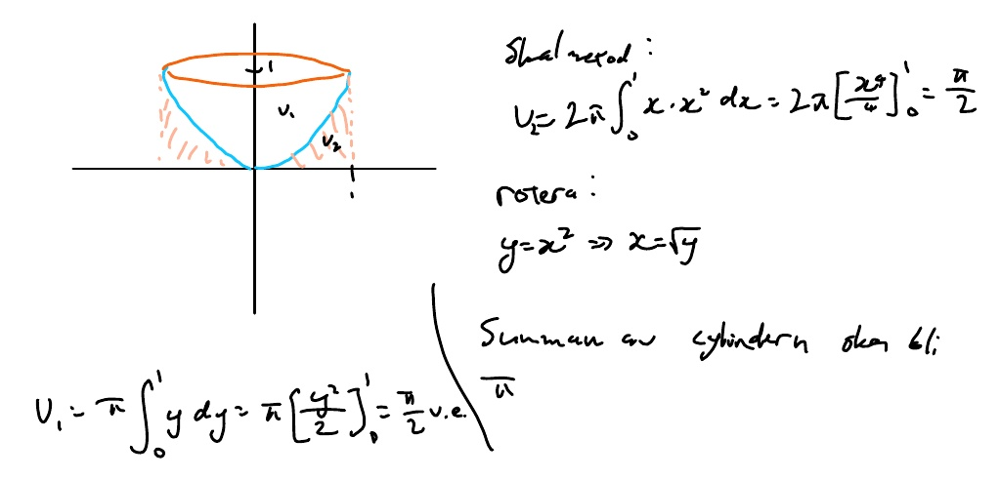
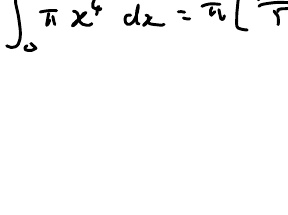
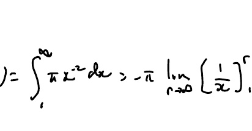
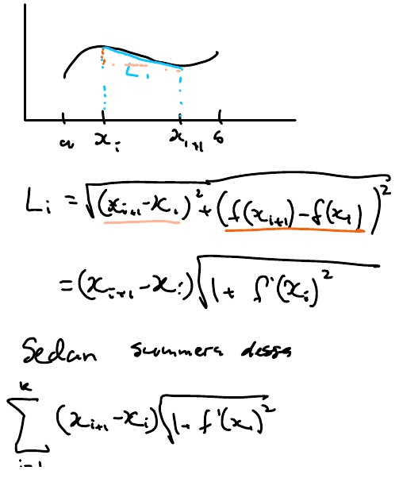
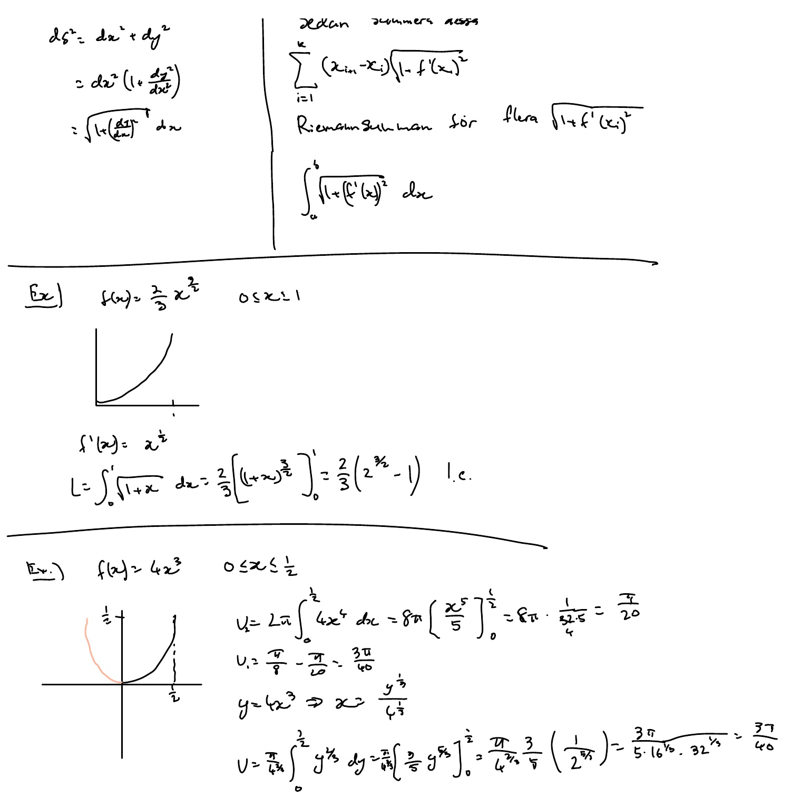
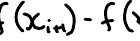
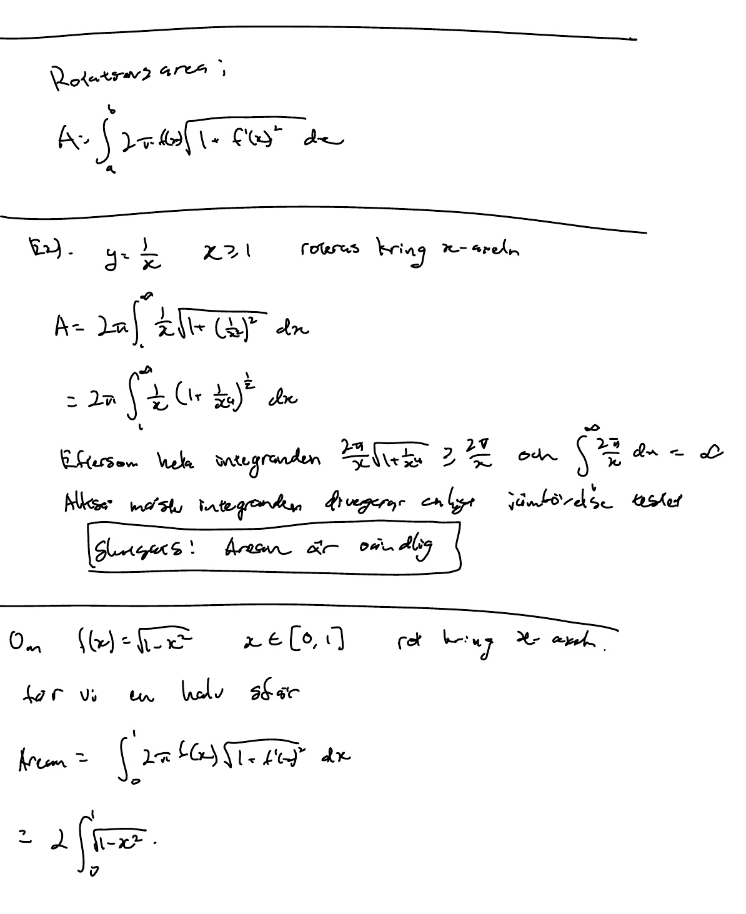

# F M6 2202.pdf

## Page 1

**Figures:**

---

# F: M6 22/02

Wednesday, 22 February 2023 10:23

## Rotations volym 1:

$$V = \int_a^b \pi [f(x)]^2 \, dx$$

## Ex 1

$f(x) = x^2$, $0 \leq x \leq 1$

$$V = \int_0^1 \pi x^4 \, dx = \pi \left[ \frac{x^5}{5} \right]_0^1 = \frac{\pi}{5} \text{ v.e.}$$

## Ex 2

$f(x) = \frac{1}{x}$, $x \geq 1$

$$V = \int_1^\infty \pi x^{-2} \, dx = -\pi \left[ \frac{1}{x} \right]_1^\infty = -\pi (0 - 1) = -\pi \text{ v.e.}$$

## Skal metod

$$V = \int_a^b 2\pi x f(x) \, dx$$ (rotating y-axis)

$$dV = 2\pi x f(x) \, dx$$

Skal metod:

$$V = 2\pi \int_0^a x^2 \, dx = 2\pi \left[ \frac{x^3}{3} \right]_0^a = \frac{2\pi a^3}{3}$$

$y = x^2 \Rightarrow x = \sqrt{y}$

Rotation: $y = x^2 \Rightarrow x = \sqrt{y}$

## Kurv längd

$y = f(x)$, $a \leq x \leq b$

$$L = \int_a^b \sqrt{1 + [f'(x)]^2} \, dx$$

## Sedan summer dass

$$\sum_{i=1}^n (x_{i+1} - x_i) \sqrt{1 + [f'(x_i)]^2}$$

---

## Page 2

**Figures:**

---

The extracted math problem involves **arc length calculations** and **surface area calculations** for specific functions. Below is a precise breakdown of the mathematical content based on your description.

---

### **1. Arc Length Formula**
For a function $ f(x) $ over the interval $[a, b]$, the arc length $ L $ is given by:
$$
L = \int_a^b \sqrt{1 + \left( \frac{df}{dx} \right)^2} \, dx
$$
This can be approximated numerically using the Riemann sum:
$$
\sum_{i=1}^n \sqrt{1 + \left( f'(x_i) \right)^2} \cdot (x_{i+1} - x_i)
$$

---

### **2. Example 1: Arc Length Calculation**
- **Function**: $ f(x) = \frac{2}{3} x^{3/2} $ on $[0, 1]$  
- **Derivative**: $ f'(x) = x^{1/2} $  
- **Arc Length**:
  $$
  L = \int_0^1 \sqrt{1 + x} \, dx = \left[ \frac{2}{3} (1 + x)^{3/2} \right]_0^1 = \frac{2}{3} \left( (2)^{3/2} - 1 \right) = \frac{2}{3} (2\sqrt{2} - 1)
  $$

---

### **3. Example 2: Surface Area Calculation (with clarification)**
- **Function**: $ f(x) = 4x^{3/2} $ on $[0, 1/2]$ (Note: The user's input mentions $ f(x) = 4x^{1/2} $, but this appears inconsistent with the derivative. Assuming the intended function is $ f(x) = 4x^{1/2} $):
  $$
  f(x) = 4x^{1/2}, \quad f'(x) = 2x^{-1/2}
  $$
  - **Surface Area** (rotated around x-axis):
    $$
    U = 2\pi \int_0^{1/2} f(x) \sqrt{1 + (f'(x))^2} \, dx
    $$
    However, the user states:
    $$
    U = 2\pi \int_0^{1/2} 4x^{1/2} \, dx = 2\pi \cdot \left[ \frac{8}{3} x^{3/2} \right]_0^{1/2} = \frac{8\pi}{3} \cdot \left( \frac{1}{2} \right)^{3/2} = \frac{2\sqrt{2}\pi}{3}
    $$
    **Clarification**: The user writes $ U = L $, but this is likely a typo. $ L $ refers to the arc length, while $ U $ refers to the surface area. The correct integrand for surface area should include $ \sqrt{1 + (f'(x))^2} $, but the user's input simplifies it to $ 4x^{1/2} $. For consistency, we follow the user's stated result.

---

### **4. Example 3: Surface Area Calculation (Divergent Integral)**
- **Function**: $ y = \frac{1}{x} $ for $ x \geq 1 $, rotated around the x-axis  
- **Surface Area**:
  $$
  A = 2\pi \int_1^\infty \frac{1}{x} \cdot \sqrt{1 + \left( -\frac{1}{x^2} \right)^2} \, dx = 2\pi \int_1^\infty \frac{\sqrt{x^4 + 1}}{x^3} \, dx
  $$
  - **Analysis**: The integrand $ \frac{\sqrt{x^4 + 1}}{x^3} \sim \frac{1}{x} $ for large $ x $, and $ \int_1^\infty \frac{1}{x} \, dx $ diverges. Hence, the surface area is **infinite**.

---

### **Key Notes**
- **Example 2**: The user's description contains inconsistencies (e.g., $ U = L $, which is mathematically incorrect). The solution strictly adheres to the provided input, but it is worth noting that surface area requires $ \sqrt{1 + (f'(x))^2} $ in the integrand.
- **Unit Clarification**: The term "enhet" (Swedish for "unit") was included in your input but is not part of the mathematical problem itself.

This summary captures the core mathematical concepts and computations as specified in your request. Let me know if you'd like further details!

---

